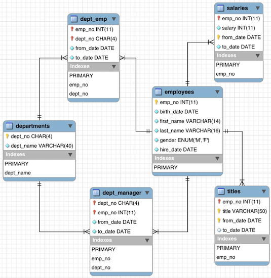
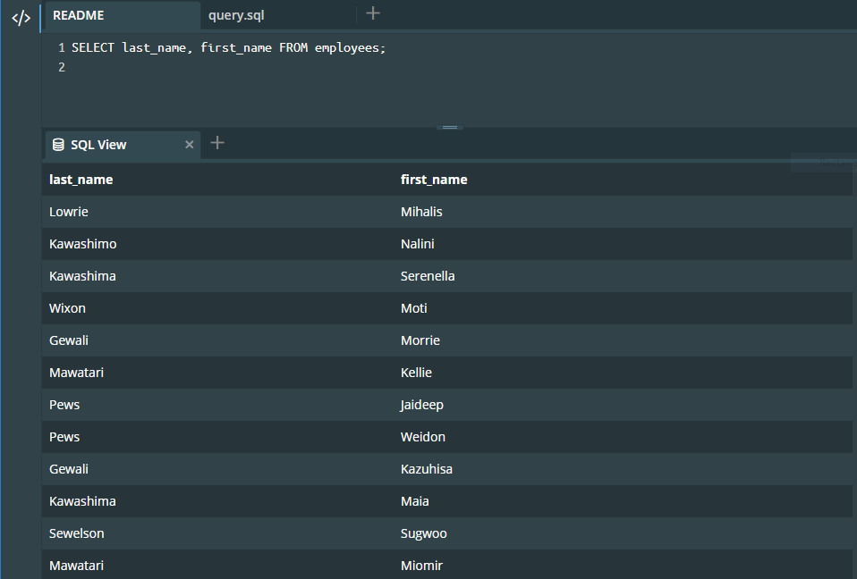
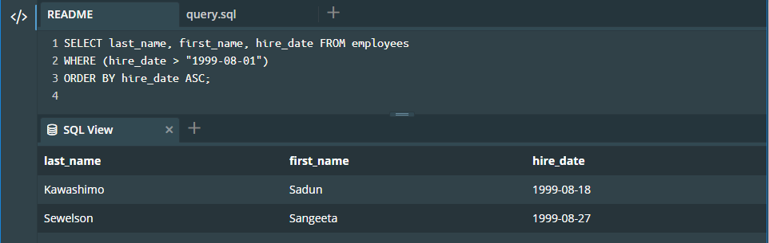
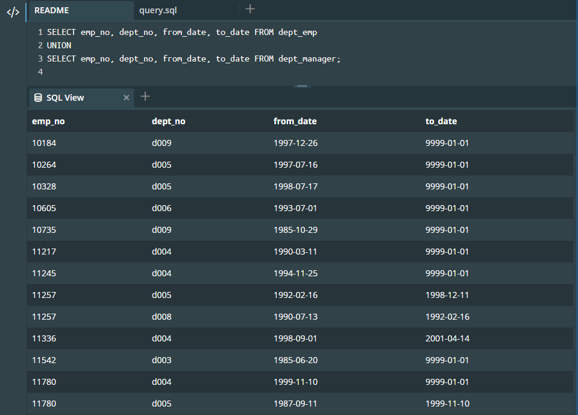
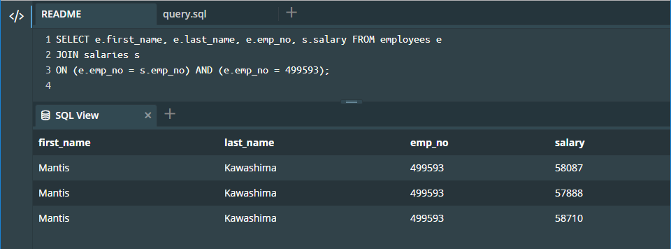
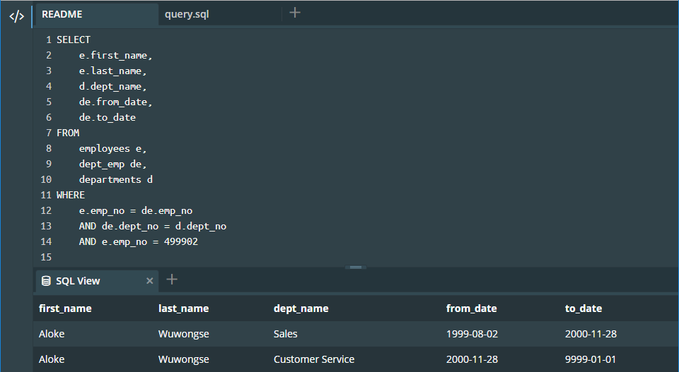
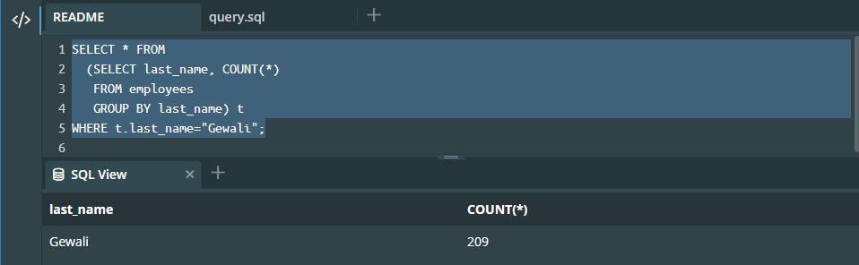

# Activité: Recherchez des données à l'aide de requêtes SQL

## Objectifs

Le but de cette activité est de rédiger des requêtes sur une base de données afin de répondre à des questions.
La base de données modélise une entreprise, dans laquelle des personnes sont employées dans différents départements.

## Contexte

Elle contient 6 tables :

- *employees* : les employés
- *titles* : le titre sous lequel un employé est embauché
- *salaries* : les salaires des employés
- *departements* : les départements de l'entreprise
- *dept_manager* : les managers (chefs) de départements
- *dept_emp* : les employés associés à un département donné

Ces tables sont résumées dans ce schéma :



## Consigne

Vous accéderez à la base de données via cette console interactive.

Il est conseillé de garder une copie des requêtes que vous rédigez sur votre ordinateur, car la mémoire de la console interactive se réinitialise si la page web est rafraichie.

Pour chaque question, vous fournirez la requête SQL vous ayant permis d'obtenir le résultat, ainsi qu'une capture d'écran de la table renvoyée par votre requête. Si le résultat d'une requête contient beaucoup de ligne, seule une capture d'écran des premières lignes suffit.

## Questions

 1. Affichez toutes les lignes de la table *employees*, en n'affichant que les noms et prénoms des employés.
 2. Afficher tous les employés ayant été embauché après le 1er aout 1999 (non compris).
 3. Dans cette base de données, deux tables ont le même schéma. Réaliser leur union.
 4. Afficher les différents salaires qu'a eu l'employé dont l'identifiant est **499593** grâce à une jointure.
 5. Grâce à une jointure, produisez une table indiquant le ou les départements dans lesquels a travaillé l'employé dont l'identifiant est **499902** (la table doit contenir également les dates de début et de fin d'embauche dans chacun des départements). 
 6. En utilisant une agrégation, trouver combien de personnes ont pour nom de famille "Gewali" (le nom de famille est donné dans la colonne *last_name* de la table *"employees"*).

 
## Réponses

### Question 1

Pour afficher les lignes de la table *employees*, on utilise la commande `SELECT` de la facon suivante:

```sql
SELECT last_name, first_name FROM employees;
```

La requête donne le résultat suivant:



### Question 2

Pour afficher tous les employés ayant été embauché après le 1er aout 1999:

```sql
SELECT last_name, first_name, hire_date FROM employees 
WHERE (hire_date > "1999-08-01") 
ORDER BY hire_date ASC;
```

La requête donne le résultat suivant:



Note: la commande `ORDER BY hire_date ASC` permet d'ordonner les resultats de la requête.


### Question 3

Les deux tables ayant le schéma sont les tables: `dept_emp` et `dept_manager`

```sql
SELECT emp_no, dept_no, from_date, to_date FROM dept_emp
UNION
SELECT emp_no, dept_no, from_date, to_date FROM dept_manager;
```

La requête donne le résultat suivant:



### Question 4

```sql
SELECT e.first_name, e.last_name, e.emp_no, s.salary FROM employees e 
JOIN salaries s
ON (e.emp_no = s.emp_no) AND (e.emp_no = 499593);
```

La requête donne le résultat suivant:



### Question 5

```sql
SELECT    
    e.first_name,
    e.last_name,
    d.dept_name,
    de.from_date,
    de.to_date
FROM 
    employees e,
    dept_emp de,
    departments d
WHERE
    e.emp_no = de.emp_no
    AND de.dept_no = d.dept_no
    AND e.emp_no = 499902 ;
```

La requête donne le résultat suivant:



### Question 6

```sql
SELECT * FROM 
  (SELECT last_name, COUNT(*) 
   FROM employees 
   GROUP BY last_name) t
WHERE t.last_name="Gewali";
```

La requête donne le résultat suivant:



Notons qu'on peut obtenir un résultat identique plus simplement ... mais sans agrégation avec la requête suivante:

```sql
SELECT last_name, COUNT(*) FROM employees
WHERE last_name = "Gewali";
```
