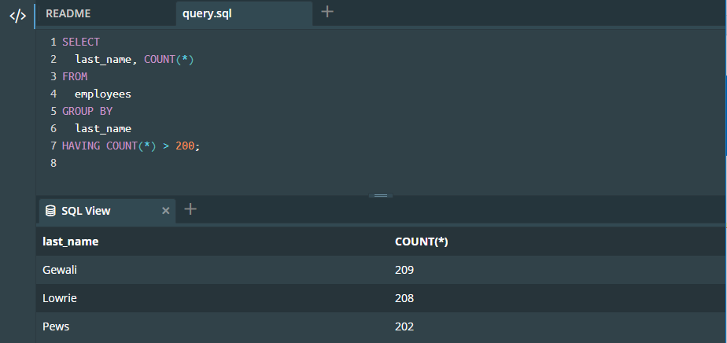
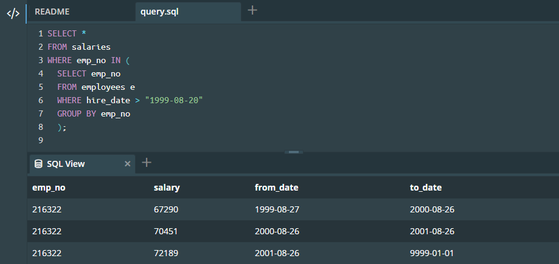
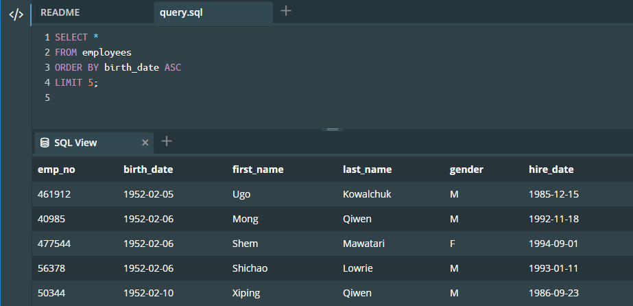
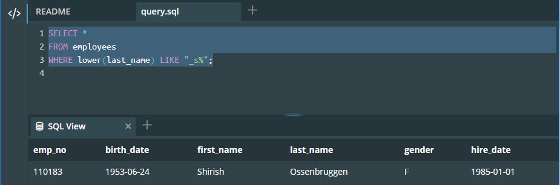

# Activité 2: Requêtes complexes

Le but de cette activité est de rédiger des requêtes sur une base de données afin de répondre à des questions. La base de données modélise une entreprise, dans laquelle des personnes sont employées dans différents départements.

## Contexte

Elle contient 6 tables :

- employees : les employés
- titles : le titre sous lequel un employé est embauché
- salaries : les salaires des employés
- departements : les départements de l'entreprise
- dept_manager : les managers (chefs) de départements
- dept_emp : les employés associés à un département donné

Ces tables sont résumées dans ce schéma :


## Consigne

Vous accéderez à la base de données via cette console interactive.

Il est conseillé de garder une copie des requêtes que vous rédigez sur votre ordinateur, car la mémoire de la console interactive se réinitialise si la page web est rafraîchie.

Pour chaque question, vous fournirez la requête SQL vous ayant permis d'obtenir le résultat, ainsi qu'une capture d'écran de la table renvoyée par votre requête. Si le résultat d'une requête contient beaucoup de ligne, seule une capture d'écran des premières lignes suffit.

## Questions

1. Sans utiliser de requêtes imbriquées, produire une table indiquant les noms de famille portés par plus de 200 employés (le nom de famille est donné dans la colonne *last_name* de *employees*).
2. En utilisant le mot clé `IN` ainsi qu'une requête imbriquée, donner les différents montants des salaires des employés embauchés après (strictement) la date du *'1999-08-20'*.
3. Afficher uniquement les 5 salariés les plus agés, en affichant telles quelles toutes les colonnes de la table employees. 
4. Afficher les salariés dont le nom de famille a pour 2ème lettre un "s", en affichant telles quelles toutes les colonnes de la table *employees*.
Utiliser le mot clé `LIKE`.

## Réponses

### Question 1

Sans utiliser de requêtes imbriquées, produire une table indiquant les noms de famille portés par plus de 200 employés (le nom de famille est donné dans la colonne *last_name* de *employees*).
 
```sql
SELECT
  last_name, COUNT(*) 
FROM
  employees
GROUP BY
  last_name
HAVING COUNT(*) > 200;
```

Le résultat de cette requête est le suivant:



### Question 2

En utilisant le mot clé `IN` ainsi qu'une requête imbriquée, donner les différents montants des salaires des employés embauchés après (strictement) la date du *'1999-08-20'*.

```sql
SELECT *
FROM salaries 
WHERE emp_no IN (
  SELECT emp_no
  FROM employees e
  WHERE hire_date > "1999-08-20"
  GROUP BY emp_no
  );
```

Le résultat de cette requête est le suivant:



### Question 3

Afficher uniquement les 5 salariés les plus agés, en affichant telles quelles toutes les colonnes de la table *employees*. 

```sql
SELECT *
FROM employees
ORDER BY birth_date ASC
LIMIT 5;
```

Le résultat de cette requête est le suivant:



### Question 4

Afficher les salariés dont le nom de famille a pour 2ème lettre un "s", en affichant telles quelles toutes les colonnes de la table *employees*.
Utiliser le mot clé `LIKE`.

```sql
SELECT *
FROM employees
WHERE lower(last_name) LIKE "_s%";
```

Le résultat de cette requête est le suivant:


